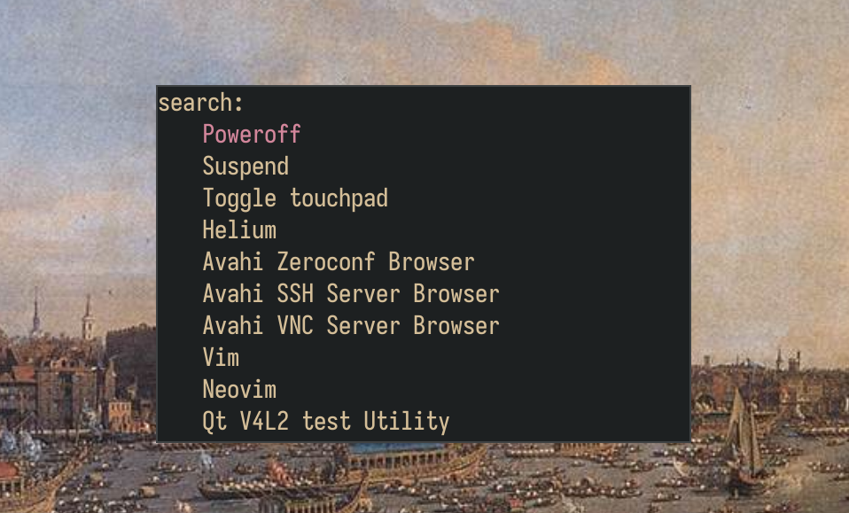

# zrun

Search and run your apps 

- Some kind of fuzzy finding
- Works
- Written in Zig. I had never touched zig before
- Uses Raylib!

Something in between dmenu, rofi, wofi and tofi.

# Installation

1. Install raylib 6.0.
2. Use the `zig build` command.
3. Run the executable.

You can do all of this using make: `make`.

> ![NOTE]
> Edit the source to change things like the font. All the customizable things
> are at the beginning.
